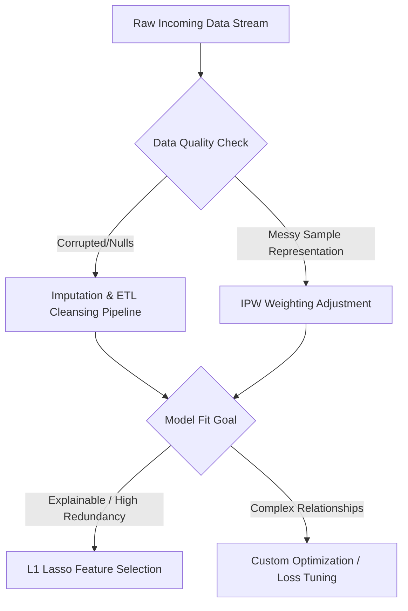

# Module 1 Programming & Industry Guide: Practical Data Science

This guide focuses on the **programming-based implementation and industry relevance** of the concepts in Module 1 (Topics 1.1 to 1.6). Rather than theoretical proofs, it shows how modern engineering teams structure pipelines, optimize models, correct for biases, and prevent overfitting on real-world datasets.

---

## 1. Programming Concept 1: Ingestion, Robust ETL, and Data Cleansing (Topics 1.1 & 1.2)

### A. Explanation
In the industry, data is rarely clean or formatted for modeling. Ingestion involves extracting raw telemetry logs or API responses, parsing dates, handling missing features (imputation), and dealing with outliers. An **ETL (Extract, Transform, Load)** pipeline is the software engineering backbone of any data team.

### B. Why It Is Needed
Poor data quality is the single largest bottleneck in production machine learning systems. Models are highly sensitive to:
* **Missing Data:** Can crash algorithms during inference or introduce subtle biases if ignored.
* **Mismatched Types:** String fields containing numbers, or unparsed timestamps that hinder temporal modeling.
* **Extreme Outliers:** Can skew linear models and distort variance estimates.

### C. Industry Applications
* **Customer Session Tracking:** E-commerce companies (e.g., Amazon, Flipkart) ingesting clickstream events, user logins, and cart additions to compute real-time recommendation matrices.
* **IoT Sensor Telemetry:** Manufacturing plants monitoring machinery vibrations to predict equipment failure.

### D. Relevant Dataset: E-Commerce User Behavior Logs
A raw, unstructured dataset containing user clickstream logs, consisting of:
* `user_id` (numeric or alpha-numeric)
* `timestamp` (messy strings with different timezones)
* `action` (view, click, add_to_cart, purchase)
* `price` (messy currency string containing "$")
* `user_age` (contains missing values `NA` or corrupted entries like negative values)

### E. Step-by-Step Procedure & R Implementation
We will build a pipeline that:
1. Simulates raw, noisy e-commerce logs.
2. Formats and cleans columns (parses prices, converts timestamps).
3. Handles missing values through statistical imputation.
4. Detects and removes invalid outliers.
5. Aggregates the data to construct user-level behavior profiles.

```R
# ETL & Data Cleansing Pipeline in R
library(dplyr)
library(tidyr)

# 1. Simulate Raw Messy Data
set.seed(101)
raw_logs <- data.frame(
  user_id = c(1001, 1002, 1003, 1004, 1005, 1001, 1002, 1006, 1007, 1008),
  timestamp = c("2026-05-28 10:15:30 UTC", "28-05-2026 10:16:00", "2026-05-28T10:17:00Z", 
                "2026-05-28 10:18:12 UTC", "2026-05-28 10:19:00", NA,
                "2026-05-28 10:21:00", "2026-05-28 10:22:00", "2026-05-28 10:23:00", "2026-05-28 10:24:00"),
  action = c("view", "view", "add_to_cart", "view", "purchase", "view", "purchase", "view", "add_to_cart", "purchase"),
  price = c("$12.99", "$45.00", "$150.00", "$9.99", "$250.00", "$12.99", "$45.00", "$19.99", "$89.99", "$-999.00"), # Negative outlier
  user_age = c(25, 34, NA, 45, 22, 25, 34, 110, 29, 31), # NA and extreme outlier (110)
  stringsAsFactors = FALSE
)

cat("--- Raw Messy Data Ingested ---\n")
print(raw_logs)

# 2. Pipeline Execution
clean_logs <- raw_logs %>%
  # Drop rows with critical missing metadata (like timestamp)
  filter(!is.na(timestamp)) %>%
  
  # Clean price: remove "$" sign, convert to numeric
  mutate(price = as.numeric(gsub("[\\$,]", "", price))) %>%
  
  # Filter out logical outliers (prices must be positive, ages must be realistic)
  filter(price > 0 & user_age < 100) %>%
  
  # Normalize timestamp formatting using lubridate-like parsing (base R alternative)
  mutate(timestamp = as.POSIXct(timestamp, tryFormats = c("%Y-%m-%d %H:%M:%S", "%d-%m-%Y %H:%M:%S", "%Y-%m-%dT%H:%M:%SZ")))

# 3. Impute Missing Values (Mean Imputation for User Age)
mean_age <- mean(clean_logs$user_age, na.rm = TRUE)
clean_logs <- clean_logs %>%
  mutate(user_age = ifelse(is.na(user_age), round(mean_age), user_age))

# 4. Aggregate to Create a Feature Store / User Profile
user_profiles <- clean_logs %>%
  group_by(user_id) %>%
  summarize(
    total_actions = n(),
    total_spend = sum(price[action == "purchase"], na.rm = TRUE),
    has_purchased = ifelse(any(action == "purchase"), 1, 0),
    user_age = first(user_age)
  )

cat("\n--- Cleaned & Aggregated User Profiles for Downstream ML ---\n")
print(user_profiles)
```

---

## 2. Programming Concept 2: Bias Correction & Stratified Sampling (Topics 1.3 & 1.4)

### A. Explanation
In corporate environments, datasets are rarely random samples. For instance, customer feedback surveys are highly skewed toward dissatisfied or highly enthusiastic users (selection bias). **Stratified Sampling** and **Inverse Probability Weighting (IPW)** are used to adjust sample statistics so they reflect the true target population.

### B. Why It Is Needed
If you launch a new product feature based on survey results without correcting for selection bias, you will build for a vocal minority. Programmatic bias correction allows data scientists to re-weight their models to predict behaviors of the average user accurately.

### C. Industry Applications
* **A/B Testing Alignment:** Guaranteeing that the Treatment and Control groups contain equivalent ratios of premium vs. free users.
* **Customer Retention Analysis:** Adjusting churn models when churn logs are disproportionately collected from specific geographical locations.

### D. Relevant Dataset: A/B Test Registration Logs
A simulated user group where high-value customers (purchased > $500) are over-represented in our feedback log compared to the true population distribution of the application.

### E. Step-by-Step Procedure & R Implementation
We will:
1. Define the true population distribution of users (Premium vs. Standard).
2. Generate a biased sample where Premium users are heavily over-represented.
3. Compute **Sample Weights** for each class based on the population ratios.
4. Calculate the weighted average spending to correct the bias, comparing it to the unweighted estimate.

```R
# Bias Detection and Weighting Adjustments

# 1. Define True Population Proportions
# True Population: 90% Standard Users, 10% Premium Users
pop_ratio_std <- 0.90
pop_ratio_prem <- 0.10

# 2. Simulate Biased Feedback Logs
# Prem users are much more likely to fill out surveys.
biased_sample <- data.frame(
  user_type = c(rep("Standard", 40), rep("Premium", 60)), # 60% Premium instead of 10%!
  spend = c(rnorm(40, mean = 20, sd = 5), rnorm(60, mean = 150, sd = 30))
)

# Unweighted sample average (Highly Biased!)
unweighted_mean_spend <- mean(biased_sample$spend)

# 3. Compute Inverse Probability Weights
# Weight = (Population Proportion) / (Sample Proportion)
sample_ratio_std <- sum(biased_sample$user_type == "Standard") / nrow(biased_sample)
sample_ratio_prem <- sum(biased_sample$user_type == "Premium") / nrow(biased_sample)

weight_std <- pop_ratio_std / sample_ratio_std
weight_prem <- pop_ratio_prem / sample_ratio_prem

# Attach weights to the sample
biased_sample <- biased_sample %>%
  mutate(weight = ifelse(user_type == "Standard", weight_std, weight_prem))

# 4. Calculate Weighted Average Spend
weighted_mean_spend <- sum(biased_sample$spend * biased_sample$weight) / sum(biased_sample$weight)

cat("=========================================\n")
cat("BIAS CORRECTION RESULTS\n")
cat("=========================================\n")
cat(sprintf("Observed (Unweighted) Spend Estimate: $%.2f\n", unweighted_mean_spend))
cat(sprintf("Corrected (Weighted) Spend Estimate : $%.2f\n", weighted_mean_spend))
cat("Note: Premium users overspend, making the raw sample mean artificially high.\n")
cat("=========================================\n")
```

---

## 3. Programming Concept 3: Optimization & Parameter Estimation from Scratch (Topic 1.5)

### A. Explanation
While industry models are fit using libraries, understanding the optimization mechanics under the hood is critical. **Gradient Descent** is the optimization engine for nearly all modern machine learning models. We define a Loss Function (like Mean Squared Error) and iteratively adjust parameter weights ($\theta$) in the opposite direction of the gradient:
$$\theta_{\text{new}} = \theta_{\text{old}} - \alpha \nabla L(\theta)$$
where $\alpha$ is the learning rate.

### B. Why It Is Needed
Using standard out-of-the-box solvers like `lm()` works for basic linear systems, but custom models (e.g. customized fraud scoring with asymmetric losses) require writing custom loss functions and optimizing them manually.

### C. Industry Applications
* **Dynamic Pricing Engines:** Fitting custom cost curves to transaction histories to optimize passenger ticket prices (e.g., Uber surge pricing).
* **Ad CTR Prediction:** Training large-scale logistic regression models using Stochastic Gradient Descent (SGD).

### D. Relevant Dataset: Advertising Spend vs. Conversions
A dataset containing marketing budgets spent on social media campaigns ($X$) and the resulting customer conversion numbers ($Y$).

### E. Step-by-Step Procedure & R Implementation
We will:
1. Define a custom Linear Model $Y = \beta_0 + \beta_1 X$.
2. Implement the Mean Squared Error (MSE) loss function.
3. Calculate gradients analytically.
4. Run a Gradient Descent loop to find the optimal $\beta_0$ and $\beta_1$ values from scratch.
5. Verify the scratch parameters against R's analytical `lm()` function.

```R
# Linear Regression via Gradient Descent from Scratch

# 1. Generate Synthetic Ad Campaign Data
set.seed(42)
X <- rnorm(100, mean = 5, sd = 2) # Ad spend (in thousands)
Y <- 3.5 * X + 12 + rnorm(100, sd = 1.5) # Conversions (with noise)

# 2. Gradient Descent Algorithm
gradient_descent <- function(X, Y, learning_rate = 0.01, epochs = 1000) {
  # Initialize parameters randomly
  beta_0 <- 0
  beta_1 <- 0
  n <- length(Y)
  
  # Log history to track learning curve
  loss_history <- numeric(epochs)
  
  for (i in 1:epochs) {
    # Predictions
    Y_pred <- beta_0 + beta_1 * X
    
    # Calculate Mean Squared Error Loss
    loss_history[i] <- sum((Y - Y_pred)^2) / n
    
    # Compute Partial Derivatives (Gradients)
    d_beta0 <- (-2/n) * sum(Y - Y_pred)
    d_beta1 <- (-2/n) * sum((Y - Y_pred) * X)
    
    # Update Weights (Gradient Descent Step)
    beta_0 <- beta_0 - learning_rate * d_beta0
    beta_1 <- beta_1 - learning_rate * d_beta1
  }
  
  return(list(beta_0 = beta_0, beta_1 = beta_1, loss_history = loss_history))
}

# 3. Fit Models
gd_model <- gradient_descent(X, Y, learning_rate = 0.01, epochs = 1500)
lm_model <- lm(Y ~ X)

# 4. Compare Estimates
cat("=========================================\n")
cat("OPTIMIZATION COMPARISON: SCRATCH vs ANALYTICAL (lm)\n")
cat("=========================================\n")
cat(sprintf("Gradient Descent (Scratch) -> Intercept (B0): %.4f | Slope (B1): %.4f\n", 
            gd_model$beta_0, gd_model$beta_1))
cat(sprintf("Standard R lm()            -> Intercept (B0): %.4f | Slope (B1): %.4f\n", 
            coef(lm_model)[1], coef(lm_model)[2]))
cat("=========================================\n")

# Plot the training path (Loss Reduction)
plot(1:100, gd_model$loss_history[1:100], type="l", col="blue", lwd=2,
     main="Optimization Progress (First 100 Epochs)",
     xlab="Epoch (Iteration)", ylab="Loss (MSE)")
```

---

## 4. Programming Concept 4: Regularization & Multi-collinearity (Topic 1.6)

### A. Explanation
When fitting regression models to high-dimensional datasets with correlated variables, traditional OLS breaks down (estimates become highly unstable with massive standard errors). **Regularization** adds a penalty term to the loss function to shrink coefficients toward zero:
* **Ridge Regression ($L_2$ Regularization):** Adds penalty $\lambda \sum \beta_j^2$. Shrinks coefficients close to zero but keeps all features.
* **Lasso Regression ($L_1$ Regularization):** Adds penalty $\lambda \sum |\beta_j|$. Drives non-essential coefficients to exactly zero, acting as automatic **Feature Selection**.

### B. Why It Is Needed
In the real world, datasets contain redundant columns (e.g., user income, household income, ZIP-code average income). Regularization protects models from overfitting to these redundancies, preserving stable generalization on test cohorts.

### C. Industry Applications
* **Gene Expression Analysis:** Predicting disease susceptibility where there are 20,000 genes (features) but only 100 patient samples.
* **Credit Scoring:** Screening hundreds of financial history characteristics to output a clean, parsimonious credit risk score.

### D. Relevant Dataset: Housing Features and Prices
A housing dataset with highly collinear variables (e.g., total square footage, number of rooms, number of bathrooms, garage capacity, lot size) predicting final sale price.

### E. Step-by-Step Procedure & R Implementation
We will:
1. Simulate high-dimensional housing data with multi-collinearity.
2. Format the variables into a matrix for `glmnet` compatibility.
3. Fit a Lasso Regression.
4. Perform **K-Fold Cross-Validation** programmatically to find the optimal tuning parameter $\lambda$.
5. Inspect the shrinkage path to see automatic feature elimination.

```R
# Regularized Regression (Lasso & Ridge) using glmnet
# If running for the first time, install glmnet: install.packages("glmnet")
library(glmnet)

# 1. Simulate High-Dimensional Collinear Housing Data
set.seed(500)
n_houses <- 150
# True predictors
sq_ft <- rnorm(n_houses, mean = 2000, sd = 500)
# Highly collinear variables
num_rooms <- sq_ft / 400 + rnorm(n_houses, sd = 0.5)
num_bathrooms <- sq_ft / 600 + rnorm(n_houses, sd = 0.3)
lot_size <- sq_ft * 5 + rnorm(n_houses, sd = 100)
# Random noise variables (irrelevant predictors)
noise_var1 <- rnorm(n_houses)
noise_var2 <- rnorm(n_houses)
noise_var3 <- rnorm(n_houses)

# Sale Price dependent on SqFt and LotSize only
price <- 150 * sq_ft + 10 * lot_size + rnorm(n_houses, mean = 50000, sd = 5000)

# Combine into design matrix X and target Y
X_matrix <- cbind(sq_ft, num_rooms, num_bathrooms, lot_size, noise_var1, noise_var2, noise_var3)
Y_vector <- price

# 2. Standard OLS Fit (Will show unstable coefficients due to collinearity)
ols_model <- lm(Y_vector ~ X_matrix)
cat("--- Standard OLS Coefficients (Notice high noise sensitivity) ---\n")
print(coef(ols_model))

# 3. Fit Lasso Regression (alpha = 1)
# glmnet automatically scales variables (essential for regularization)
lasso_fit <- glmnet(X_matrix, Y_vector, alpha = 1)

# 4. Perform K-Fold Cross Validation to choose optimal Lambda (Penalty Strength)
cv_lasso <- cv.glmnet(X_matrix, Y_vector, alpha = 1, nfolds = 10)

cat("\n=========================================\n")
cat("LASSO CROSS-VALIDATION RESULTS\n")
cat("=========================================\n")
cat(sprintf("Optimal Lambda (Minimizing CV Error): %.3f\n", cv_lasso$lambda.min))
cat(sprintf("Largest Lambda within 1 Standard Error: %.3f\n", cv_lasso$lambda.1se))
cat("=========================================\n")

# 5. Extract Coefficients at the optimal lambda.1se
# This eliminates unnecessary variables by driving coefficients to 0
optimal_coefs <- coef(cv_lasso, s = "lambda.1se")
cat("\n--- Optimal Regularized Lasso Coefficients (Feature Selection Active) ---\n")
print(optimal_coefs)

# Plot Coefficient Shrinkage Paths
plot(lasso_fit, xvar = "lambda", label = TRUE, main = "Lasso Coefficient Shrinkage Path")
abline(v = log(cv_lasso$lambda.min), col="red", lty=2)
```
---

## Summary Cheat Sheet for Production Design

When deploying these algorithms, use this checklist to guide your architectural decisions:


* **Use L1 (Lasso) Regularization** when your primary goal is model simplicity, parsimonious inference, or automatic feature reduction.
* **Use L2 (Ridge) Regularization** when you have highly correlated predictors and you want to prevent extreme weight fluctuations while retaining all features.
* **Always run Cross-Validation** to select hyper-parameters (such as $\lambda$ or learning rate $\alpha$). Tuning on the train set guarantees overfitting.
* **Apply weights (IPW)** when your data collection mechanism has a demographic bias, ensuring your model generalizes to the whole population, not just a vocal subset.
